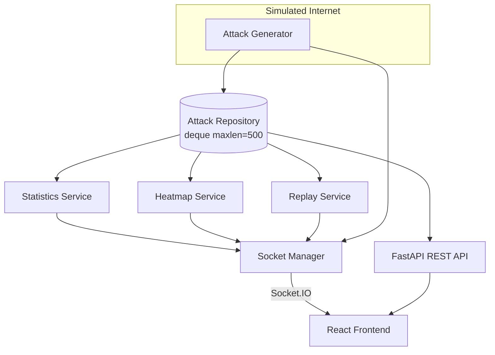

# CyberAI Live Threat Map — Backend

Production-ready Python backend for the **CyberAI SOC Dashboard** Live Threat Map module. Continuously generates realistic simulated cyber attack events and streams them to connected clients via **Socket.IO**, while exposing REST APIs for filtering, statistics, heatmaps, and timeline replay.

---

## Tech Stack

| Layer | Technology |
|-------|------------|
| Runtime | Python 3.12 |
| API Framework | FastAPI |
| ASGI Server | Uvicorn |
| Real-time | python-socketio (Socket.IO) |
| Validation | Pydantic v2 |
| Config | pydantic-settings, python-dotenv |
| Simulation | Faker, asyncio |
| Geo | GeoJSON (country point features) |
| Storage | In-memory `deque` (PostgreSQL-ready repositories) |
| Optional | Redis, PostgreSQL (reserved via env vars) |

---

## Architecture



**Data flow**

1. `AttackGenerator` creates a realistic attack event every `SOCKET_INTERVAL` seconds (default: 1s).
2. Events are stored in `AttackRepository` (bounded to 500 entries).
3. `HeatmapService` and `StatisticsService` aggregate metrics.
4. `StreamService` broadcasts events over Socket.IO.
5. The React frontend subscribes to live events and queries REST endpoints for filters/replay.

---

## Project Structure

```
backend/
├── app/
│   ├── api/                  # REST routes and dependency injection
│   │   ├── deps.py           # AppContainer + FastAPI Depends providers
│   │   └── routes/           # attacks, countries, statistics, replay, heatmap
│   ├── websocket/            # Socket.IO manager and event constants
│   ├── services/             # Business logic (generator, heatmap, stats, replay, stream)
│   ├── models/               # Domain models (AttackEvent, Country)
│   ├── schemas/              # Pydantic API request/response schemas
│   ├── generators/           # RandomDataGenerator (IPs, UA, ASN, endpoints)
│   ├── repositories/         # Storage abstraction (in-memory, swappable for PostgreSQL)
│   ├── config/               # Settings from environment
│   ├── middleware/           # CORS configuration
│   ├── utils/                # Time helpers, GeoJSON utilities
│   ├── data/
│   │   └── countries.json    # 74 countries with lat/lon, continent, risk_level
│   └── main.py               # FastAPI app + Socket.IO ASGI mount
├── tests/                    # Unit tests
├── requirements.txt
├── .env.example
└── README.md
```

---

## Quick Start

### 1. Prerequisites

- Python 3.12+
- pip or uv

### 2. Install

```bash
cd backend
python -m venv .venv
source .venv/bin/activate   # Windows: .venv\Scripts\activate
pip install -r requirements.txt
```

### 3. Configure

```bash
cp .env.example .env
```

Edit `.env` as needed (defaults work for local development).

### 4. Run

```bash
uvicorn app.main:asgi_app --host 0.0.0.0 --port 8000 --reload
```

- **REST API docs:** http://localhost:8000/docs
- **Health check:** http://localhost:8000/health
- **Socket.IO:** ws://localhost:8000 (same host/port)

---

## Environment Variables

| Variable | Default | Description |
|----------|---------|-------------|
| `HOST` | `0.0.0.0` | Bind host |
| `PORT` | `8000` | Bind port |
| `DEBUG` | `false` | Enable debug logging |
| `SOCKET_INTERVAL` | `1.0` | Seconds between new attack events |
| `SUMMARY_INTERVAL` | `5.0` | Seconds between summary broadcasts |
| `REDIS_URL` | _(empty)_ | Reserved for Redis pub/sub |
| `DATABASE_URL` | _(empty)_ | Reserved for PostgreSQL |
| `CORS_ORIGINS` | `http://localhost:5173,...` | Allowed frontend origins |
| `ATTACK_BUFFER_SIZE` | `500` | Replay buffer capacity |

---

## Socket.IO Events

### Client → Server

| Event | Payload | Description |
|-------|---------|-------------|
| `ping_client` | `{ "any": "data" }` | Optional heartbeat |

### Server → Client

| Event | Frequency | Description |
|-------|-----------|-------------|
| `connection:success` | On connect | Handshake with available event list |
| `attack:new` | Every 1s | New attack event (full payload) |
| `attack:summary` | Every 5s | Severity breakdown |
| `heatmap:update` | Every 5s | Country → attack count map |
| `statistics:update` | Every 5s | Full dashboard statistics |
| `timeline:update` | Every 5s | Recent attacks for timeline UI |

### Example: Connect from JavaScript

```javascript
import { io } from 'socket.io-client'

const socket = io('http://localhost:8000', {
  transports: ['websocket', 'polling'],
})

socket.on('connection:success', (data) => console.log('Connected', data))
socket.on('attack:new', (attack) => console.log('New attack', attack))
socket.on('attack:summary', (summary) => console.log('Summary', summary))
socket.on('heatmap:update', (heatmap) => console.log('Heatmap', heatmap))
socket.on('statistics:update', (stats) => console.log('Stats', stats))
socket.on('timeline:update', (timeline) => console.log('Timeline', timeline))
```

### `attack:new` payload example

```json
{
  "id": 1,
  "timestamp": "2026-07-03T12:30:45Z",
  "source_country": "Russia",
  "destination_country": "India",
  "source_latitude": 61.82,
  "source_longitude": 105.11,
  "destination_latitude": 20.59,
  "destination_longitude": 78.96,
  "source_ip": "185.76.23.10",
  "destination_ip": "103.21.10.2",
  "attack_type": "SQL Injection",
  "severity": "Critical",
  "status": "Blocked",
  "endpoint": "/login",
  "http_method": "POST",
  "request_count": 382,
  "duration_ms": 1240,
  "confidence": 94.2,
  "risk_score": 96,
  "protocol": "HTTPS",
  "user_agent": "sqlmap/1.8.2#stable",
  "asn": "AS12345",
  "city": "Moscow",
  "isp": "Rostelecom",
  "country_code": "RU",
  "latitude": 61.82,
  "longitude": 105.11
}
```

### `attack:summary` payload example

```json
{
  "total_attacks": 1204,
  "critical": 104,
  "high": 220,
  "medium": 400,
  "low": 480
}
```

### `heatmap:update` payload example

```json
{
  "India": 240,
  "Russia": 80,
  "United States": 140
}
```

---

## REST API

Base path: `/api`

### GET `/api/attacks`

List attack events with optional filters.

| Query Param | Type | Description |
|-------------|------|-------------|
| `country` | string | Source or destination country |
| `severity` | string | `Low`, `Medium`, `High`, `Critical` |
| `attack_type` | string | e.g. `SQL Injection`, `DDoS` |
| `status` | string | `Blocked`, `Mitigated`, `Detected`, etc. |
| `time_range` | string | `15m`, `1h`, `6h`, `24h`, `7d` |
| `limit` | int | Max results (1–500, default 100) |
| `offset` | int | Pagination offset |

### GET `/api/countries`

Returns all 74 countries with geolocation and risk metadata.

| Query Param | Type | Description |
|-------------|------|-------------|
| `continent` | string | Filter by continent |
| `risk_level` | string | `Low`, `Medium`, `High`, `Critical` |

### GET `/api/countries/{country_code}`

Single country by ISO code (e.g. `US`, `IN`).

### GET `/api/statistics`

Full statistics snapshot with the same filter params as `/api/attacks`.

### GET `/api/statistics/summary`

Severity breakdown only.

### GET `/api/replay`

Returns the last 500 attacks for timeline replay (supports same filters).

### GET `/api/heatmap`

Country-level attack intensity.

| Query Param | Type | Description |
|-------------|------|-------------|
| `country` | string | Filter by country |
| `time_range` | string | Time window filter |

### GET `/health`

Service health and connected Socket.IO client count.

### Custom endpoints — `/api/custom/*`

Self-serve endpoints for checking realtime data live in
[`app/api/routes/custom.py`](app/api/routes/custom.py). Ships with:

| Endpoint | Description |
|----------|-------------|
| `GET /api/custom/realtime?limit=N` | One-call snapshot: stream status, severity summary, latest N attacks, heatmap counts |
| `GET /api/custom/attacks/latest` | The single most recent attack event |
| `GET /api/custom/buffer` | In-memory buffer counters (stored / capacity / total ingested / severity counts) |

---

## Adding Your Own API

All custom endpoints go in `app/api/routes/custom.py` — no other file needs to change.

1. Pick a data source from `app/api/deps.py` (`get_attack_repo`, `get_statistics_service`, `get_heatmap_service`, `get_replay_service`, `get_stream_service`, `get_country_repo`).
2. Copy an existing endpoint in `custom.py`, change the path and logic:

```python
@router.get("/my-endpoint")
async def my_endpoint(
    attack_repo: AttackRepository = Depends(get_attack_repo),
) -> dict:
    attacks = await attack_repo.get_all()
    return {"critical": [a for a in attacks if a.severity == "Critical"]}
```

3. Save the file — when running with `--reload`, uvicorn restarts automatically.
4. Test it in the interactive docs at <http://localhost:8000/docs> (it appears under the **Custom** tag) or with `curl http://localhost:8000/api/custom/my-endpoint`.

Run the server with hot reload:

```bash
cd backend
.venv/bin/python -m uvicorn app.main:asgi_app --port 8000 --reload
```

---

## Attack Types

The generator randomly selects from:

- SQL Injection
- Cross Site Scripting
- Command Injection
- Credential Stuffing
- Bot Attack
- Brute Force
- Path Traversal
- Remote Code Execution
- SSRF
- DDoS
- Directory Traversal
- File Inclusion
- Malware Download
- API Abuse
- Rate Limit Violation

High-risk source countries (Russia, China, Iran, etc.) are weighted more heavily as attack origins.

---

## Testing

```bash
cd backend
pytest -v
```

Tests cover:

- `AttackGenerator` — event shape, ID sequencing, coordinate bounds
- `HeatmapService` — counting, rebuild, API response
- `ReplayService` — chronological order, buffer limits
- `StatisticsService` — severity counts, session totals

---

## Extending to Production

The repository layer is designed for drop-in replacement:

```python
# Today: in-memory
attack_repo = AttackRepository(max_size=500)

# Future: PostgreSQL implementation with the same async interface
# attack_repo = PostgresAttackRepository(database_url=settings.database_url)
```

Set `DATABASE_URL` and `REDIS_URL` in `.env` when ready to integrate persistent storage and horizontal scaling via Redis pub/sub.

---

## License

Part of the CyberAI SOC Dashboard project.
